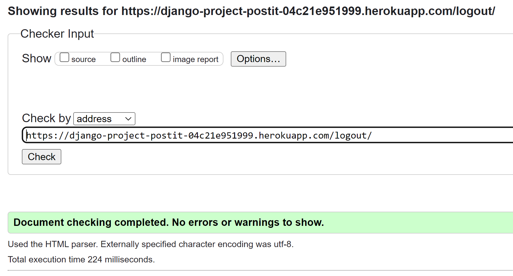
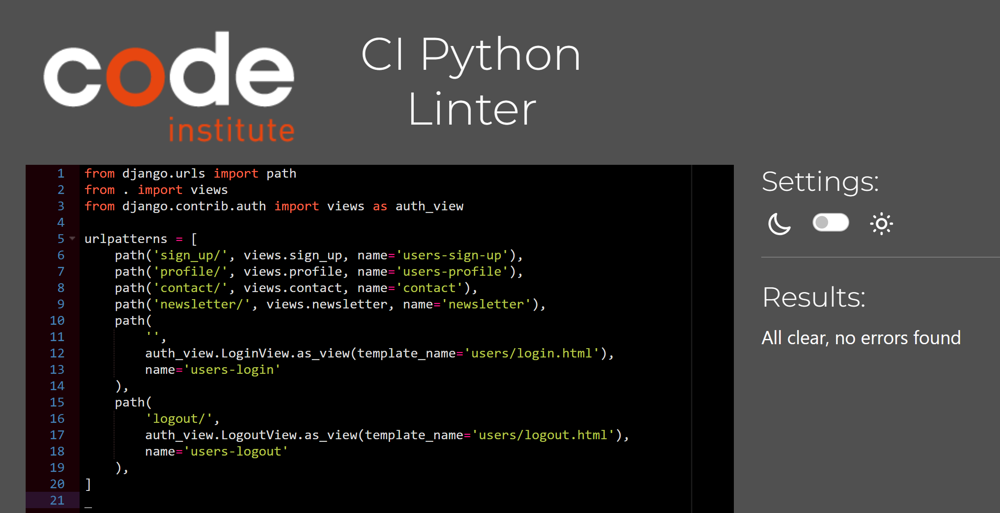
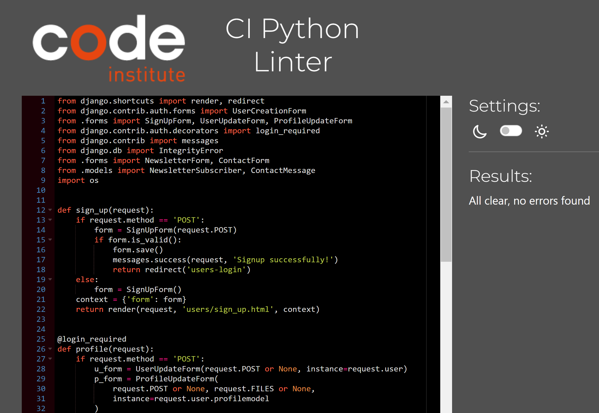
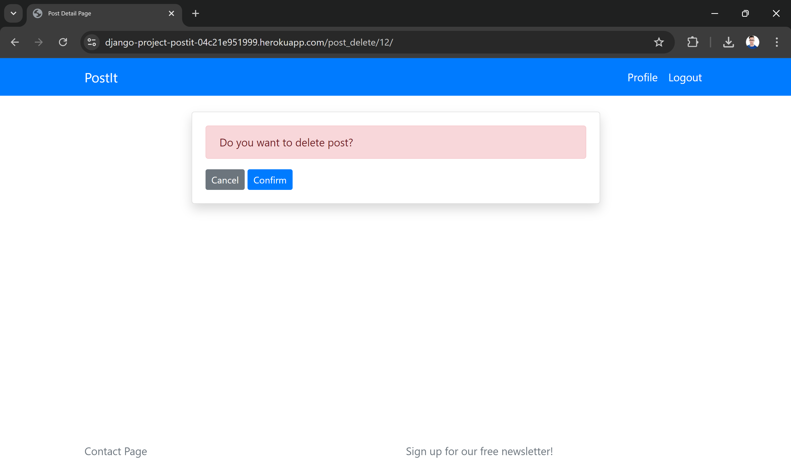
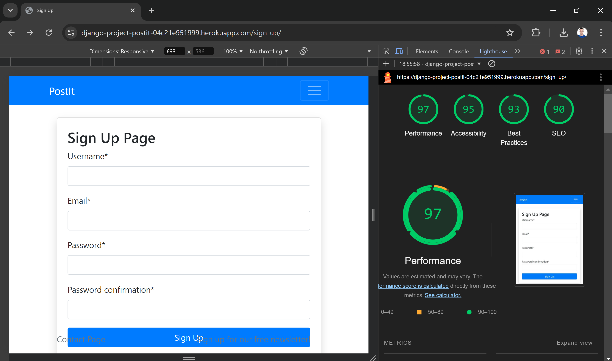
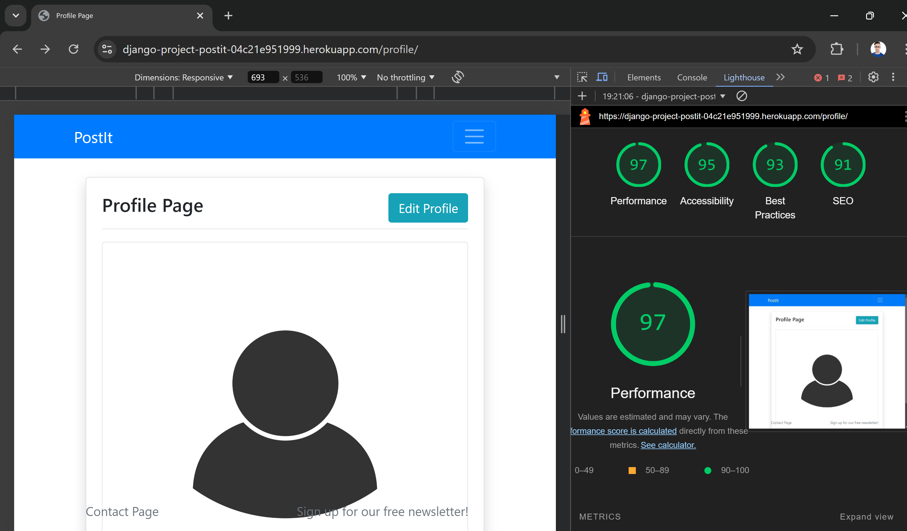

# PostIt - Social Media

**PostIt** is an innovative social media platform, built using Django, that allows users to interact in real-time.

Users can sign up with their username and email address to post what’s on their mind. Posts can be edited, deleted, and commented on by other users.

In addition, this platform includes a contact form and allows users to sign up for a newsletter.

Mockup Image

https://ui.dev/amiresponsive?url=https://django-project-postit-04c21e951999.herokuapp.com/


# UX

It was important to me to establish a clear design structure in which users can easily find their way.

Everything is clearly laid out, and interactions are acknowledged with feedback messages.


## Colour Scheme


- `#007BFF` used for navigation.
- `#000000` used for primary text.
- `#28A745` used for buttons.
- `#D9D9D9` used for secondary highlights.
- `#FFFFFF` used for secondary text.

## User Stories


## Wireframes

### Mobile


### Tablet Wireframes


### Desktop Wireframes


## Features

My focus was on implementing CRUD-functionality.

CRUD stands for 'create, read, update, and 
 delete' which are the four basic operations used in web applications to manage data.
 
 In my project, these operations allow users to:

- Create new entries (like adding a new blog post).
- Read or view existing entries (like viewing all blog posts).
- Update existing entries (like editing a post).
- Delete entries (like removing a post).

### Future Features

In the future I plan to implement thumbnails or media previews for posts on the main page so that users get a visual sense of the content.


## Tools & Technologies Used

- [](https://tim.2bn.dev/markdown-builder) used to generate README and TESTING templates.
- [](https://git-scm.com) used for version control. (`git add`, `git commit`, `git push`)
- [](https://github.com) used for secure online code storage.
- [](https://gitpod.io) used as a cloud-based IDE for development.
- [](https://en.wikipedia.org/wiki/HTML) used for the main site content.
- [](https://en.wikipedia.org/wiki/CSS) used for the main site design and layout.
- [](https://www.javascript.com) used for user interaction on the site.
- [](https://www.python.org) used as the back-end programming language.
- [](https://www.heroku.com) used for hosting the deployed back-end site.
- [](https://getbootstrap.com) used as the front-end CSS framework for modern responsiveness and pre-built components.
- [](https://www.djangoproject.com) used as the Python framework for the site.
- [](https://dbs.ci-dbs.net) used as the Postgres database from Code Institute.
- [](https://cloudinary.com) used for online static file storage.
- [](https://whitenoise.readthedocs.io) used for serving static files with Heroku.
- [](https://www.figma.com) used for creating wireframes.
- [](https://chat.openai.com) used to help debug, troubleshoot, and explain things.


## Database Design

I have used `pygraphviz` and `django-extensions` to auto-generate an ERD.

The steps taken were as follows:
- In the terminal: `sudo apt update`
- then: `sudo apt-get install python3-dev graphviz libgraphviz-dev pkg-config`
- then type `Y` to proceed
- then: `pip3 install django-extensions pygraphviz`
- in my `settings.py` file, I added the following to my `INSTALLED_APPS`:
```python
INSTALLED_APPS = [
    ...
    'django_extensions',
    ...
]
```
- back in the terminal: `python3 manage.py graph_models -a -o erd.png`
- dragged the new `erd.png` file into my `documentation/` folder
- removed `'django_extensions',` from my `INSTALLED_APPS`
- finally, in the terminal: `pip3 uninstall django-extensions pygraphviz -y`


source: [medium.com](https://medium.com/@yathomasi1/1-using-django-extensions-to-visualize-the-database-diagram-in-django-application-c5fa7e710e16)


source: [mermaid](https://mermaid.live/edit#pako:eNqVVNuOgjAQ_RXSZ_0B37x0NyYqG8HsCwkZYcS60Jp2WLNR_32LshIsJixP7czp9Mw5Q88sUSmyEUM9E5BpKCLp2W8T8LV3vq-rT0jyRNrsDWkhM680qCUU6CSwAJE70SMYc1LarbMT2lDcWSkHJ7NVKkeQnjCxIdjtOjOQkPh-cag8oq6oN9kUCEkUeL8uV5mQHclqER-UkFi3cI1q2Mfaf5sv-NKf8UUP3UQBGbZRFZ9YPNed-qtwPA2XPAjG77xH5X-4YcrtARNy4gUa06L36N-gpBioU1SN8Ex-xT-DBQ9Dvg42k2C6nk96DVU323ZjDaVyaxIttpg-iDWm-EHY1xESlLvCJUqS7bl9Gkraq8Yrd0ISqwWha-VyyVdhDy6dt7bm4y94VHZanaG5_byXy3CoLq3BHHkR24OJmAuryVWIkxaED1CjoYt8UetxpF2NDViB2nqb2ufmJkLEaI_WVVYBU9BfFexqcVZhFfzIhI1IlzhgWpXZno12kBu7K4-VyvVzVUevvw4XcS0)

## Testing

### Navigation

I tested the site's navigation by moving between all the main sections (home, about, portfolio, contact) and verified that the links were directing to the correct destinations. The transitions between pages were smooth with no lag or delay. The URL updates correctly, and the navigation bar consistently highlights the current section.
All internal and external links were tested, and they functioned as expected, taking the user to the appropriate pages without errors.
Responsive Design:

### Compatibility Testing

To ensure the site worked seamlessly across multiple devices, I tested it on different screen sizes, including desktops, tablets, and mobile phones. The design automatically adjusted to fit smaller screens without compromising the layout, readability, or functionality. The images and text resized appropriately, and there were no issues with overflowing or hidden content.

### Contact & Newsletter

I filled out the contact and newsletter form multiple times to verify that submissions were processed correctly. Upon submission, the user receives a clear confirmation message that their inquiry was successfully sent. On the backend, I received the form submissions in my designated email account without delay, ensuring the process worked flawlessly.


### Browser Testing

I tested the site across multiple browsers, including Chrome, Firefox, Safari, and Edge, to ensure consistent functionality and appearance. In each browser, the site loaded without any noticeable differences in layout, features, or performance. Interactive elements, such as buttons and navigation links, behaved as expected, and no browser-specific issues were encountered.
Device Compatibility:

The site was thoroughly tested on a range of devices, including desktop computers, laptops, tablets, and mobile phones (iPhone and Android). Across all devices, the site maintained its responsive design, and there were no issues with functionality or display. The images, text, and buttons adjusted well to different screen sizes, providing a consistent and optimized experience.
Performance Testing:

### Speed and Load Testing

Using tools like PageSpeed Insights and GTmetrix, I measured the site’s load time across both desktop and mobile platforms. The results were well within acceptable ranges, with quick loading times. I made further optimizations to reduce image sizes and cache static resources, improving the overall page speed for both desktop and mobile users.

Scalability Testing
To ensure the site could handle increased traffic, I performed simulated load tests. These tests indicated that the site remained stable under high user loads, without experiencing slowdowns or server crashes. This demonstrated that the site can scale effectively as traffic grows.

### Regression Testing

After implementing fixes based on performance testing and user feedback (such as optimizing images and refining the mobile layout), I conducted regression testing to verify that no previous features were affected. Each key functionality—such as navigation, portfolio display, and the contact form—continued to work smoothly after the updates. No new issues were introduced, confirming that the improvements did not impact existing features.

### Documentation and Logs

Throughout the testing process, I documented every step, including the tools used, test cases, results, and any bugs encountered. This systematic approach ensured that all issues were tracked and resolved. Additionally, each update or fix was logged to maintain a clear record of changes and their impact on the site’s functionality.
User Feedback Incorporation:
User feedback played a significant role in shaping the final design and functionality of the site. For instance, users suggested that page load times on mobile could be faster, and I implemented optimizations based on this input. Additionally, based on user feedback, I made adjustments to the layout on smaller screens to enhance readability and interaction. These changes resulted in a more polished and user-friendly experience across all devices.


## Code Validation

### HTML

I have used the recommended [HTML W3C Validator](https://validator.w3.org) to validate all of my HTML files.

| Directory | File | Screenshot | Notes |
| --- | --- | --- | --- |
| templates | index.html |  | |
| templates | post_delete.html |  | |
| templates | post_detail.html |  | |
| templates | post_edit.html |  | |
| templates | contact.html |  | |
| templates | login.html |  | |
| templates | logout.html |  | |
| templates | newsletter.html |  | |
| templates | profile.html |  | |
| templates | sign_up.html |  | |


### CSS

I have used the recommended [CSS Jigsaw Validator](https://jigsaw.w3.org/css-validator) to validate all of my CSS files.

| Directory | File | Screenshot | Notes |
| --- | --- | --- | --- |
| static | style.css |  | |

### Python

I have used the recommended [PEP8 CI Python Linter](https://pep8ci.herokuapp.com) to validate all of my Python files.

| Directory | File | CI URL | Screenshot | Notes |
| --- | --- | --- | --- | --- |
| blog | admin.py | [PEP8 CI](https://pep8ci.herokuapp.com/https://raw.githubusercontent.com/fgit-24/Django-Blog-Project/main/blog/admin.py) |  | |
| blog | forms.py | [PEP8 CI](https://pep8ci.herokuapp.com/https://raw.githubusercontent.com/fgit-24/Django-Blog-Project/main/blog/forms.py) |  | |
| blog | models.py | [PEP8 CI](https://pep8ci.herokuapp.com/https://raw.githubusercontent.com/fgit-24/Django-Blog-Project/main/blog/models.py) |  | |
| blog | urls.py | [PEP8 CI](https://pep8ci.herokuapp.com/https://raw.githubusercontent.com/fgit-24/Django-Blog-Project/main/blog/urls.py) |  | |
| blog | views.py | [PEP8 CI](https://pep8ci.herokuapp.com/https://raw.githubusercontent.com/fgit-24/Django-Blog-Project/main/blog/views.py) |  | |
|  | manage.py | [PEP8 CI](https://pep8ci.herokuapp.com/https://raw.githubusercontent.com/fgit-24/Django-Blog-Project/main/manage.py) |  | |
| myproject | settings.py | [PEP8 CI](https://pep8ci.herokuapp.com/https://raw.githubusercontent.com/fgit-24/Django-Blog-Project/main/myproject/settings.py) |  |Line 41 is CSRF_TRUSTED_ORIGINS |
| myproject | urls.py | [PEP8 CI](https://pep8ci.herokuapp.com/https://raw.githubusercontent.com/fgit-24/Django-Blog-Project/main/myproject/urls.py) |  | |
| users | admin.py | [PEP8 CI](https://pep8ci.herokuapp.com/https://raw.githubusercontent.com/fgit-24/Django-Blog-Project/main/users/admin.py) |  | |
| users | forms.py | [PEP8 CI](https://pep8ci.herokuapp.com/https://raw.githubusercontent.com/fgit-24/Django-Blog-Project/main/users/forms.py) |  | |
| users | models.py | [PEP8 CI](https://pep8ci.herokuapp.com/https://raw.githubusercontent.com/fgit-24/Django-Blog-Project/main/users/models.py) |  | |
| users | signals.py | [PEP8 CI](https://pep8ci.herokuapp.com/https://raw.githubusercontent.com/fgit-24/Django-Blog-Project/main/users/signals.py) |  | |
| users | urls.py | [PEP8 CI](https://pep8ci.herokuapp.com/https://raw.githubusercontent.com/fgit-24/Django-Blog-Project/main/users/urls.py) |  | |
| users | views.py | [PEP8 CI](https://pep8ci.herokuapp.com/https://raw.githubusercontent.com/fgit-24/Django-Blog-Project/main/users/views.py) |  | |


## Browser Compatibility


- [Chrome](https://www.google.com/chrome)
- [Firefox (Developer Edition)](https://www.mozilla.org/firefox/developer)
- [Edge](https://www.microsoft.com/edge)


I've tested my deployed project on multiple browsers to check for compatibility issues.

| Page | Google Chrome | Microsoft Edge | Mozialla Firefox | Notes |
| --- | --- | --- | --- | --- |
| Index |  |  |  | Works as expected |
| Contact |  |  |  | Works as expected |
| Signup |  |  |  | Works as expected |
| Login |  |  |  | Works as expected |
| Logout |  |  |  | Works as expected |
| Profile |  |  |  | Works as expected |
| Post Edit |  |  |  | Works as expected |
| Post Delete |  |  |  | Works as expected |
| Post Detail |  |  |  | Works as expected |


## Responsiveness

- Mobile
- Tablet
- Desktop


I've tested my deployed project on multiple devices to check for responsiveness issues.

| Device | Home | About | Contact | etc | Notes |
| --- | --- | --- | --- | --- | --- |
| Mobile (DevTools) |  |  |  |  | Works as expected |
| Tablet (DevTools) |  |  |  |  | Works as expected |
| Desktop |  |  |  |  | Works as expected |
| 


## Lighthouse Audit

I've tested my deployed project using the Lighthouse Audit tool to check for any major issues.

| Page | Mobile | Desktop | Notes |
| --- | --- | --- | --- |
| Index |  |  | Works as expected |
| Contact |  |  | Works as expected |
| Newsletter |  |  | Works as expected |
| Signup |  |  | Works as expected |
| Login |  |  | Works as expected |
| Logout |  |  | Works as expected |
| Profile |  |  | Works as expected |
| Post Edit |  |  | Works as expected |
| Post Delete |  |  | Works as expected |
| Post Detail |  |  | Works as expected |


## Defensive Programming

Forms:
- Users cannot submit an empty form
- Users must enter valid email addresses


| Page | User Action | Expected Result | Pass/Fail | Comments |
| --- | --- | --- | --- | --- |
| Home | | | | |
| | Click on Logo | Redirection to Home page | Pass | |
| | Click on Home link in navbar | Redirection to Home page | Pass | |
| Gallery | | | | |
| | Click on Gallery link in navbar | Redirection to Gallery page | Pass | |
| | Load gallery images | All images load as expected | Pass | |
| Contact | | | | |
| | Click on Contact link in navbar | Redirection to Contact page | Pass | |
| | Enter first/last name | Field will accept freeform text | Pass | |
| | Enter valid email address | Field will only accept email address format | Pass | |
| | Enter message in textarea | Field will accept freeform text | Pass | |
| | Click the Submit button | Redirects user to form-dump | Pass | User must click 'Back' button to return |
| Sign Up | | | | |
| | Click on Sign Up button | Redirection to Sign Up page | Pass | |
| | Enter valid email address | Field will only accept email address format | Pass | |
| | Enter valid password (twice) | Field will only accept password format | Pass | |
| | Click on Sign Up button | Asks user to confirm email page | Pass | Email sent to user |
| | Confirm email | Redirects user to blank Sign In page | Pass | |
| Log In | | | | |
| | Click on the Login link | Redirection to Login page | Pass | |
| | Enter valid email address | Field will only accept email address format | Pass | |
| | Enter valid password | Field will only accept password format | Pass | |
| | Click Login button | Redirects user to home page | Pass | |
| Log Out | | | | |
| | Click Logout button | Redirects user to logout page | Pass | Confirms logout first |
| | Click Confirm Logout button | Redirects user to home page | Pass | |
| Profile | | | | |
| | Click on Profile button | User will be redirected to the Profile page | Pass | |
| | Click on the Edit button | User will be redirected to the edit profile page | Pass | |
| | Click on the My Orders link | User will be redirected to the My Orders page | Pass | |
| | Brute forcing the URL to get to another user's profile | User should be given an error | Pass | Redirects user back to own profile |


## Unfixed Bugs

Unfixed Bugs

## Deployment

The live deployed application can be found deployed on [Heroku](https://django-project-postit-04c21e951999.herokuapp.com).

### PostgreSQL Database

This project uses a [Code Institute PostgreSQL Database](https://dbs.ci-dbs.net).

To obtain my own Postgres Database from Code Institute, I followed these steps:

- Signed-in to the CI LMS using my email address.
- An email was sent to me with my new Postgres Database.

> [!CAUTION]  
> - PostgreSQL databases by Code Institute are only available to CI Students.
> - You must acquire your own PostgreSQL database through some other method
> if you plan to clone/fork this repository.
> - Code Institute students are allowed a maximum of 8 databases.
> - Databases are subject to deletion after 18 months.

### Heroku Deployment

This project uses [Heroku](https://www.heroku.com), a platform as a service (PaaS) that enables developers to build, run, and operate applications entirely in the cloud.

Deployment steps are as follows, after account setup:

- Select **New** in the top-right corner of your Heroku Dashboard, and select **Create new app** from the dropdown menu.
- Your app name must be unique, and then choose a region closest to you (EU or USA), and finally, select **Create App**.
- From the new app **Settings**, click **Reveal Config Vars**, and set your environment variables.

> [!IMPORTANT]  
> This is a sample only; you would replace the values with your own if cloning/forking my repository.

| Key | Value |
| --- | --- |
| `AWS_ACCESS_KEY_ID` | user's own value |
| `AWS_SECRET_ACCESS_KEY` | user's own value |
| `DATABASE_URL` | user's own value |
| `DISABLE_COLLECTSTATIC` | 1 (*this is temporary, and can be removed for the final deployment*) |
| `EMAIL_HOST_PASS` | user's own value |
| `EMAIL_HOST_USER` | user's own value |
| `SECRET_KEY` | user's own value |
| `STRIPE_PUBLIC_KEY` | user's own value |
| `STRIPE_SECRET_KEY` | user's own value |
| `STRIPE_WH_SECRET` | user's own value |
| `USE_AWS` | True |

Heroku needs three additional files in order to deploy properly.

- requirements.txt
- Procfile
- runtime.txt

You can install this project's **requirements** (where applicable) using:

- `pip3 install -r requirements.txt`

If you have your own packages that have been installed, then the requirements file needs updated using:

- `pip3 freeze --local > requirements.txt`

The **Procfile** can be created with the following command:

- `echo web: gunicorn app_name.wsgi > Procfile`
- *replace **app_name** with the name of your primary Django app name; the folder where settings.py is located*

The **runtime.txt** file needs to know which Python version you're using:
1. type: `python3 --version` in the terminal.
2. in the **runtime.txt** file, add your Python version:
	- `python-3.9.19`

For Heroku deployment, follow these steps to connect your own GitHub repository to the newly created app:

Either:

- Select **Automatic Deployment** from the Heroku app.

Or:

- In the Terminal/CLI, connect to Heroku using this command: `heroku login -i`
- Set the remote for Heroku: `heroku git:remote -a app_name` (replace *app_name* with your app name)
- After performing the standard Git `add`, `commit`, and `push` to GitHub, you can now type:
	- `git push heroku main`

The project should now be connected and deployed to Heroku!

### Local Deployment

This project can be cloned or forked in order to make a local copy on your own system.

For either method, you will need to install any applicable packages found within the *requirements.txt* file.

- `pip3 install -r requirements.txt`.

You will need to create a new file called `env.py` at the root-level,
and include the same environment variables listed above from the Heroku deployment steps.

> [!IMPORTANT]  
> This is a sample only; you would replace the values with your own if cloning/forking my repository.

Sample `env.py` file:

```python
import os

os.environ.setdefault("AWS_ACCESS_KEY_ID", "user's own value")
os.environ.setdefault("AWS_SECRET_ACCESS_KEY", "user's own value")
os.environ.setdefault("DATABASE_URL", "user's own value")
os.environ.setdefault("EMAIL_HOST_PASS", "user's own value")
os.environ.setdefault("EMAIL_HOST_USER", "user's own value")
os.environ.setdefault("SECRET_KEY", "user's own value")
os.environ.setdefault("STRIPE_PUBLIC_KEY", "user's own value")
os.environ.setdefault("STRIPE_SECRET_KEY", "user's own value")
os.environ.setdefault("STRIPE_WH_SECRET", "user's own value")

# local environment only (do not include these in production/deployment!)
os.environ.setdefault("DEBUG", "True")
```

Once the project is cloned or forked, in order to run it locally, you'll need to follow these steps:

- Start the Django app: `python3 manage.py runserver`
- Stop the app once it's loaded: `CTRL+C` or `⌘+C` (Mac)
- Make any necessary migrations: `python3 manage.py makemigrations`
- Migrate the data to the database: `python3 manage.py migrate`
- Create a superuser: `python3 manage.py createsuperuser`
- Load fixtures (if applicable): `python3 manage.py loaddata file-name.json` (repeat for each file)
- Everything should be ready now, so run the Django app again: `python3 manage.py runserver`

If you'd like to backup your database models, use the following command for each model you'd like to create a fixture for:

- `python3 manage.py dumpdata your-model > your-model.json`
- *repeat this action for each model you wish to backup*

#### Cloning

You can clone the repository by following these steps:

1. Go to the [GitHub repository](https://github.com/fgit-24/Django-Blog-Project) 
2. Locate the Code button above the list of files and click it 
3. Select if you prefer to clone using HTTPS, SSH, or GitHub CLI and click the copy button to copy the URL to your clipboard
4. Open Git Bash or Terminal
5. Change the current working directory to the one where you want the cloned directory
6. In your IDE Terminal, type the following command to clone my repository:
	- `git clone https://github.com/fgit-24/Django-Blog-Project.git`
7. Press Enter to create your local clone.

Alternatively, if using Gitpod, you can click below to create your own workspace using this repository.

[](https://gitpod.io/#https://github.com/fgit-24/Django-Blog-Project)

Please note that in order to directly open the project in Gitpod, you need to have the browser extension installed.
A tutorial on how to do that can be found [here](https://www.gitpod.io/docs/configure/user-settings/browser-extension).

#### Forking

By forking the GitHub Repository, we make a copy of the original repository on our GitHub account to view and/or make changes without affecting the original owner's repository.
You can fork this repository by using the following steps:

1. Log in to GitHub and locate the [GitHub Repository](https://github.com/fgit-24/Django-Blog-Project)
2. At the top of the Repository (not top of page) just above the "Settings" Button on the menu, locate the "Fork" Button.
3. Once clicked, you should now have a copy of the original repository in your own GitHub account!


## Credits

| Source | Location | Notes |
| --- | --- | --- |
| [Markdown Builder](https://tim.2bn.dev/markdown-builder) | README and TESTING | tool to help generate the Markdown files |
| [YouTube](https://www.youtube.com/@KenBroTech) | General functionality and blog building | I've made many modifications, and I created the contact and newsletter models from scratch. |

## Acknowledgements

- I would like to thank my Code Institute mentor, [Tim Nelson](https://github.com/TravelTimN) for his support throughout the development of this project.
- I would like to thank the [Code Institute](https://codeinstitute.net) tutor team for their assistance with troubleshooting and debugging some project issues.
